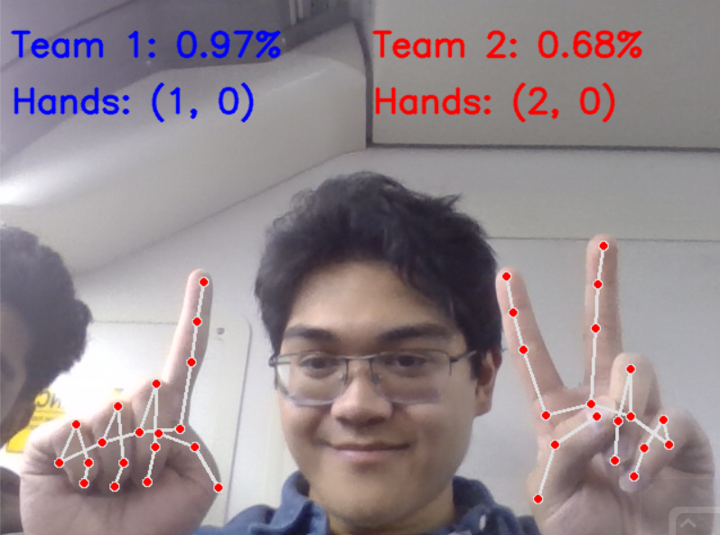

# description
Uses AI to track hand movement for the game chopsticks
when there is two hands percentage will appear that signifys the win percentage.

The winrate shown is the percent chance if they do any random move, the chance of the player winning.
There is two percent sides because it depends on whos turn it is.

To quit the program do CTRL+C



# # how to run

1. clone repository
2. run the following commands in the terminal
    * ```pip install opencv-python```
    * ```pip install mediapipe```
    * ```pip install numpy```
3. run the handtrack.py

# DO NOT RUN percent_generater.py
the data is organized in a specific way

